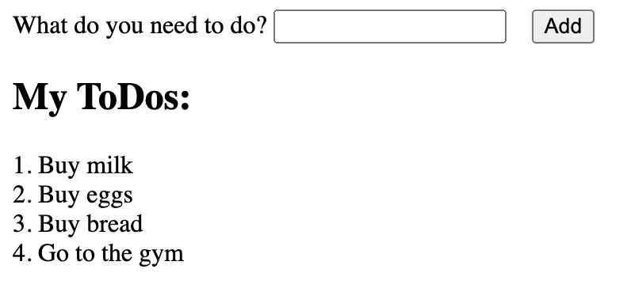

# React Basics: Building a ToDo List

In this exercise, we will be covering the the three main concepts of React: components, props, and state.

# Part 1: Components

Using the following image as a base, draw squares around all of the individual components. You should be able to find _at least_ 4 components.



Now that we have our components highlighted, we can start deconstructing the application into components.

The following is the html for the above image. We will be using this as a base for our application. You can paste it into the body of your `index.html` file.

```html
  <div>
    <form>
      <label>
        What do you need to do?
        <input type="text" value="" /> 
      </label>
      <button>Add</button>
    </form>
  </div>
  <h2>My ToDos:</h2>
  <ol>
    <li>Buy milk</li>
    <li>Buy eggs</li>
    <li>Buy bread</li>
    <li>Go to the gym</li>
  </ol>
```

With the components you highlighted in the first step, convert the html into simple react components. You can use the following as a base for a component:

```tsx
function MyComponent() {
    return (
        <p>My Component</p>
    )
}
```

These functions can go in the `<script>` tag of your `index.html` file, above the `Root` component.

You should end up with _at least_ 4 components, one for each of the components you highlighted in the first step.

Now, we can start to build our application using the components we have created.

You will be modifying the following function in your `index.html` file:
```tsx
function Root() {
    return <h1>Hello, world!</h1>;
}
```
Instead of `<h1>Hello, world!</h1>`, use the components you created to build the application as it appears in the image above.

When you're ready, switch to the `1-react-basics-part-2` branch to continue.


# Part 2: Props
If you skipped part one, or had any issues with it, you can use the following code as a base for this part of the exercise:

```tsx
function Form() {
    return (
        <form>
            <label>
                What do you need to do?
                <input type="text" value="" /> 
            </label>
            <button>Add</button>
        </form>
    )
}
function List() {
    return (
        <ol>
            <ListItem></ListItem>
            <ListItem></ListItem>
            <ListItem></ListItem>
            <ListItem></ListItem>
        </ol>
    )
}
function ListItem() {
    return (
        <li>Buy milk</li>
    )
}
function ToDoList() {
    return (
        <div>
            <Form></Form>
            <h2>My ToDos:</h2>
            <List></List>
        </div>
    )
}


function Root() {
    return <ToDoList></ToDoList>;
}
```

Simply copy and paste the above code into the script tag of your `index.html` file, and you should be ready to go.

Now that we have our components, we can start to pass data between them. We can do this using props.

Props are passed to a component as an object. The object can contain any data you want to pass to the component. The component can then use that data to render itself.

Let's start by passing some data to our `ListItem` component. We will be passing the title of the todo item as a prop.

```tsx
function ListItem(props) {
    return (
        <li>{props.title}</li>
    )
}
```
Remember, we can deconstruct the props object to make it easier to read:

```tsx
function ListItem({title}) {
    return (
        <li>{title}</li>
    )
}
```

Now that we are passing data to our `ListItem` component, we need to update the `List` component to pass the data to the `ListItem` component.

```tsx
function List() {
    return (
        <ol>
            <ListItem title="Buy milk"></ListItem>
            <ListItem title="Buy eggs"></ListItem>
            <ListItem title="Buy bread"></ListItem>
            <ListItem title="Go to the gym"></ListItem>
        </ol>
    )
}
```

Now, we can pass the data from the `List` component to the `ListItem` component. But this code is repetitive, and contains static data. We can improve this by using an array of todo items, and mapping over them to create the list items.

But where should that array of data live?

- [ ] In the `List` component
- [ ] In the `Root` component
- [ ] In the `ListItem` component
- [ ] In the `Form` component
- [ ] In the `ToDoList` component

<details>
<summary>Answer</summary>

- [ ] In the `List` component
- [ ] In the `Root` component
- [ ] In the `ListItem` component
- [ ] In the `Form` component
- [x] In the `ToDoList` component

The `ToDoList` component is the parent of both the `List` and `Form` components. It is the only component that has access to both the form data and the list data. Therefore, it is the best place to store the data.
</details>

Using this knowledge, update the `ToDoList` component to store the todo items in an array, and pass them to the `List` component, finally rendering them by mapping over the array. Remember, to map over an array, you need to pass a unique key to each item in the array, so include that as a part of your todo item data structure.

When you're ready, switch to the `1-react-basics-part-3` branch to continue.


# Part 3: State
If you skipped part two, or had any issues with it, you can use the following code as a base for this part of the exercise:

```tsx
function Form() {
    return (
        <form>
            <label>
                What do you need to do?
                <input type="text" value="" /> 
            </label>
            <button>Add</button>
        </form>
    )
}
function List({todos}) {
    return (
        <ol>
            {todos.map(({id, title}) => <ListItem key={id} title={title}></ListItem>)}
        </ol>
    )
}
function ListItem({title}) {
    return (
        <li>{title}</li>
    )
}
function ToDoList() {
    const todos = [
        {id: 1, title: 'Buy milk'},
        {id: 2, title: 'Buy eggs'},
        {id: 3, title: 'Buy bread'},
        {id: 4, title: 'Go to the gym'},
    ];
    return (
        <div>
            <Form></Form>
            <List todos={todos}></List>
        </div>
    )
}


function Root() {
    return <ToDoList></ToDoList>;
}
```

Simply copy and paste the above code into the script tag of your `index.html` file, and you should be ready to go.

Now that we have our components, we can start to manage the state of our application. Remember, state is data that changes over time. In our application, the state is the todo items. We can add, remove, and update the todo items, and the state of our application will change.

We can manage the state of our application using the `React.useState` hook. The `useState` hook returns an array with two items in it.


## Part 3.1: Adding state to the Form component

Lets start by adding the `React.useState` hook to our `Form` component. We will use it to store the value of the input field, and also implement a handler that will log the value of the input field to the console when the form is submitted.

```tsx
function Form() {
    // add the React.useState hook here

    // pass the state to the value attribute of the input field
    // use the onChange event handler on the input field to update the state

    // add function handleSubmit(event) here

    // Note: the handleSubmit function will receive an event object as an argument. The default behavior of a form is to submit the form and refresh the page. We want to prevent this default behavior, so we need to call event.preventDefault() in our handleSubmit function.

    // add the handleSubmit function to the onSubmit event handler of the form

    return (
        <form>
            <label>
                What do you need to do?
                <input type="text" /> 
            </label>
            <button>Add</button>
        </form>
    )
}
```

When you're ready, switch to the `1-react-basics-part-3-2` branch to continue.

## Part 3.2: Adding state to the ToDoList component

If you skipped part 3.1, or had any issues with it, you can use the following code as a base for this part of the exercise:

```tsx
function Form() {
    const [value, setValue] = React.useState('');

    function handleSubmit(event) {
        event.preventDefault();
        console.log(value);
    }

    return (
        <form onSubmit={handleSubmit}>
            <label>
                What do you need to do?
                <input type="text" value={value} onChange={event => setValue(event.target.value)} /> 
            </label>
            <button>Add</button>
        </form>
    )
}

function List({todos}) {
    return (
        <ol>
            {todos.map(({id, title}) => <ListItem key={id} title={title}></ListItem>)}
        </ol>
    )
}

function ListItem({title}) {
    return (
        <li>{title}</li>
    )
}

function ToDoList() {
    const todos = [
        {id: 1, title: 'Buy milk'},
        {id: 2, title: 'Buy eggs'},
        {id: 3, title: 'Buy bread'},
        {id: 4, title: 'Go to the gym'},
    ];
    return (
        <div>
            <Form></Form>
            <List todos={todos}></List>
        </div>
    )
}


function Root() {
    return <ToDoList></ToDoList>;
}
```

Simply copy and paste the above code into the script tag of your `index.html` file, and you should be ready to go.


Now that we have added state to the `Form` component, we can add state to the `ToDoList` component. We will be modifying it to store the todo items in state, rather than in a static array.

We will also create a function that will add a new todo item to the list of todo items. We will pass this function to the `Form` component, so that it can add new todo items to the list.

When changing the state of an array, it is important to remember that you should never mutate the array directly. Instead, you should create a new array, and then set the state to the new array. This is because React uses a technique called [shallow comparison](https://reactjs.org/docs/shallow-compare.html) to determine if the state has changed. If you mutate the array directly, React will not detect the change, and will not re-render the component.

Question: When updating the state of an array, what would be considered the correct way to do it in the `addFruit` function below?

```tsx
function Fruits() {
    const [fruits, setFruits] = React.useState(['apple', 'banana', 'orange']);

    function addFruit(fruit) {

    }
}
```

- [ ] `setFruits(fruits.push(fruit))`
- [ ] `setFruits([...fruits, fruit])`
- [ ] `fruits.push(fruit)`
- [ ] `fruits.concat(fruit)`

<details>
<summary>Answer</summary>

- [ ] `setFruits(fruits.push(fruit))`
- [x] `setFruits([...fruits, fruit])`
- [ ] `fruits.push(fruit)`
- [ ] `fruits.concat(fruit)`

When updating the state of an array in React, it's important to create a new array instead of mutating the existing one directly. Option B uses the spread operator (...) to create a new array that includes all the elements from the existing fruits array and adds the new fruit to the end. By calling setFruits with the new array, React will properly detect the state change and trigger a re-render of the component
</details>

With this knowledge, add the todo list state and change handlers to the `ToDoList` component.

When you're ready, switch to the `1-react-basics-part-3-3` branch to continue.

## Part 3.3: Handling the form submission

If you skipped part 3.2, or had any issues with it, you can use the following code as a base for this part of the exercise:

```tsx
function Form() {
    const [value, setValue] = React.useState('');

    function handleSubmit(event) {
        event.preventDefault();
        console.log(value);
    }

    return (
        <form onSubmit={handleSubmit}>
            <label>
                What do you need to do?
                <input type="text" value={value} onChange={event => setValue(event.target.value)} /> 
            </label>
            <button>Add</button>
        </form>
    )
}

function List({todos}) {
    return (
        <ol>
            {todos.map(({id, title}) => <ListItem key={id} title={title}></ListItem>)}
        </ol>
    )
}

function ListItem({title}) {
    return (
        <li>{title}</li>
    )
}

function ToDoList() {
    const [todos, setTodos] = React.useState([
        {id: 1, title: 'Buy milk'},
        {id: 2, title: 'Buy eggs'},
        {id: 3, title: 'Buy bread'},
        {id: 4, title: 'Go to the gym'},
    ]);

    function addTodoItem(title) {
        setTodos([...todos, {id: todos.length + 1, title}]);
    }
    
    return (
        <div>
            <Form></Form>
            <List todos={todos}></List>
        </div>
    )
}


function Root() {
    return <ToDoList></ToDoList>;
}
```

Simply copy and paste the above code into the script tag of your `index.html` file, and you should be ready to go.

Just like regular data, functions can be passed as props to child components. We will be passing the `addTodoItem` function to the `Form` component, so that it can add new todo items to the list.

Update the `Form` component to call the `addTodoItem` function when the form is submitted.

When you're ready, switch to the `1-react-basics-complete` branch to continue.

## Review
The finished code for this exercise can be found in the `index.html` file.

In this exercise, we have learned how to:

- Create a React component
- Render a React component
- Pass props to a React component
- Create a React component that uses state
- Update the state of a React component
- Pass functions as props to a React component
- Call a function passed as a prop to a React component
