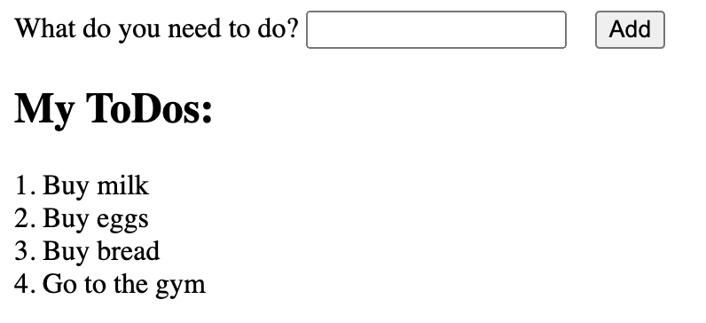

# Part 1: Components

Using the following image as a base, draw squares around all of the individual components. You should be able to find _at least_ 4 components.



Now that we have our components highlighted, we can start deconstructing the application into components.

The following is the html for the above image. We will be using this as a base for our application. You can paste it into the body of your `index.html` file.

```html
<div>
  <form>
    <label>
      What do you need to do?
      <input type="text" value="" />
    </label>
    <button>Add</button>
  </form>
</div>
<h2>My ToDos:</h2>
<ol>
  <li>Buy milk</li>
  <li>Buy eggs</li>
  <li>Buy bread</li>
  <li>Go to the gym</li>
</ol>
```

With the components you highlighted in the first step, convert the html into simple react components. You can use the following as a base for a component:

```tsx
function MyComponent() {
  return <p>My Component</p>;
}
```

These functions can go in the `<script>` tag of your `index.html` file, above the `Root` component.

You should end up with _at least_ 4 components, one for each of the components you highlighted in the first step.

Now, we can start to build our application using the components we have created.

You will be modifying the following function in your `index.html` file:

```tsx
function Root() {
  return <h1>Hello, world!</h1>;
}
```

Instead of `<h1>Hello, world!</h1>`, use the components you created to build the application as it appears in the image above.

When you're ready, switch to [2 Props](./2-props.md) to learn how to pass data between components.
